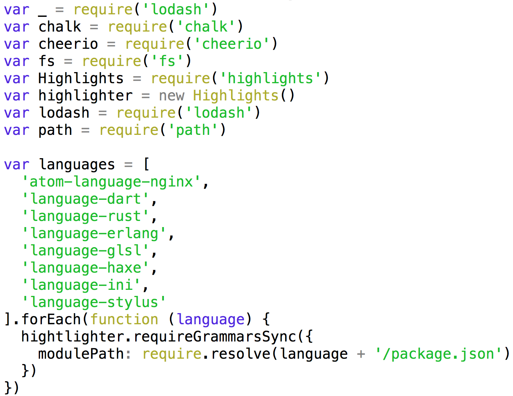

# onigurumajs

[](https://travis-ci.org/bcoe/onigurumajs)
[](https://coveralls.io/r/bcoe/onigurumajs?branch=master)
[](https://www.npmjs.com/package/onigurumajs)

implementation of the [node-oniguruma API](https://github.com/atom/node-oniguruma/) using
[xregexp](https://github.com/slevithan/xregexp), various shims, replacements, and elbow grease.

# Why does this exist?

1. It would be nice to be able to parse [TextMate grammars](https://manual.macromates.com/en/language_grammars) (the basis for syntax highlighting in Atom) in pure JS:



2. JavaScript's regex parser lacks some useful features, such as [lookbehinds](http://www.regular-expressions.info/lookaround.html). onigurumajs adds them.

## Usage

See [node-oniguruma](https://github.com/atom/node-oniguruma/).

## Adds support to JavaScript for

* extended xregexp syntax described here: http://xregexp.com/syntax/
* leading lookbehind zero-length assertions:

```js
var scanner = new OnigScanner(['(?<!a)b'])
scanner.test('bb') // match.
scanner.test('ab') // fails to match.
```

* lookbehind assertions following alternation characters:

```js
var scanner = new OnigScanner(['cat|(?<!a)b'])
scanner.test('cat') // match.
scanner.test('bb') // match.
scanner.test('ab') // fails to match.
```

* `\x{xxxx}` format unicode escape codes

```js
var scanner = new NOnigScanner(['\\x{2603}'])
scanner.findNextMatchSync('☃') // match.
```

## Contribute

This is a work in progress please join in, [open some issues](https://github.com/bcoe/onigurumajs/issues/new), submit pull requests, and help build a crazy full-featured regex parser for JavaScript.

## License

ISC
